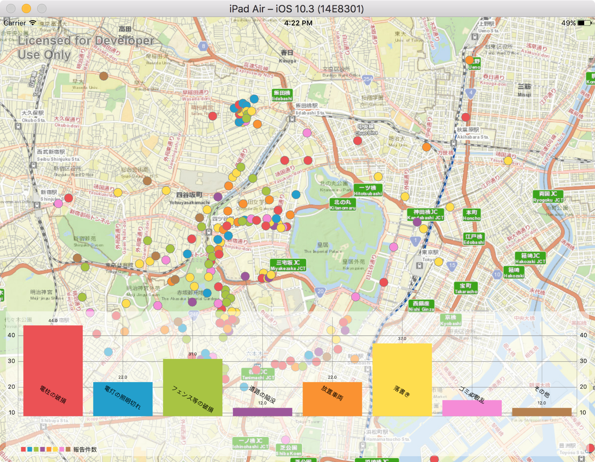

# chart-map

地図上で空間検索した結果をもとにバーチャートを表示するサンプルです。
地図をズーム・パンニングすると、地図上の表示範囲でデータを空間検索し、データの個数をバーチャートで表示します。
空間検索には [ArcGIS Runtime SDK for iOS 10.2.x](https://developers.arcgis.com/ios/10-2/) 、チャート表示には [Charts](https://github.com/danielgindi/Charts) を使用しています。

